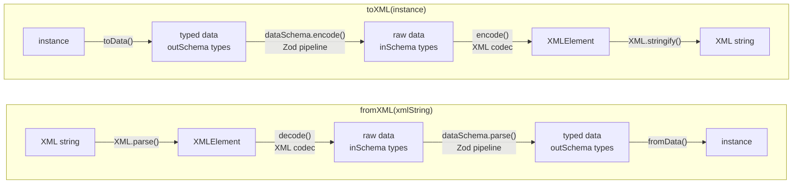

# Models

A **model** is a class produced by `xmlModel()`. It carries a Zod schema that drives both parsing and serialisation, and exposes static helpers for converting to and from XML.

## Creating a model

Pass a Zod schema and an optional `{ tagname }` for the root element. Plain Zod types become child elements automatically; use `xml.attr()` for XML attributes and `xml.prop()` when you need to customise an element:

```ts
import { z } from "zod";
import { xmlModel, xml } from "xml-model";

class Article extends xmlModel(
  z.object({
    slug: xml.attr(z.string()),
    title: z.string(),
  }),
  { tagname: "article" },
) {}
```

When `tagname` is omitted the class name is converted to kebab-case automatically (`ArticleSection` → `<article-section>`).

## Static API

| Method / property                         | Description                                                                                                    |
| ----------------------------------------- | -------------------------------------------------------------------------------------------------------------- |
| `MyClass.fromXML(xml)`                    | Parses an XML string or `XMLRoot` and returns a `MyClass` instance.                                            |
| `MyClass.toXML(instance)`                 | Converts an instance to an `XMLRoot` document tree.                                                            |
| `MyClass.toXMLString(instance, options?)` | Converts an instance to an XML string.                                                                         |
| `MyClass.dataSchema`                      | The raw `ZodObject` schema. Use for codec internals, `z.array()`, or `.extend()`.                              |
| `MyClass.schema()`                        | Returns a `ZodPipe` that transforms parsed data into a class instance. Use inside `xml.prop()` or `z.array()`. |

## Parsing pipeline

`fromXML` and `toXML` are two-layer pipelines. The XML codec layer handles serialization between raw XML and inSchema types (strings, numbers, plain objects). The Zod layer handles type transforms between inSchema and outSchema types (e.g. `string → Date`, raw data `→` class instance).

::: code-group

```txt
fromXML(xmlString)                      toXML(instance)
──────────────────                      ───────────────
  XML string                              instance
      │ XML.parse()                           │ toData()
      ▼                                       ▼
  XMLElement                             typed data  (outSchema types)
      │ decode()        [XML codec]           │ dataSchema.encode()  [Zod]
      ▼                                       ▼
  raw data  (inSchema types)             raw data  (inSchema types)
      │ dataSchema.parse()    [Zod]           │ encode()       [XML codec]
      ▼                                       ▼
  typed data  (outSchema types)          XMLElement
      │ fromData()                            │ XML.stringify()
      ▼                                       ▼
  instance                               XML string
```

<!-- mermaid id not built-in right now so we keep diagram for later maybe -->



:::

- **XML codec** (`decode` / `encode`) — converts between `XMLElement` and inSchema types. For a `z.string()` field this is the text content; for a ZodObject it is a plain data object; for a nested model it is that model's raw data.
- **Zod pipeline** (`dataSchema.parse` / `dataSchema.encode`) — applies `z.codec` transforms (e.g. ISO string → `Date`) and constructs class instances. Unknown keys are stripped here, which is why a state-bearing base class is needed for round-trip preservation.

## Class extension via `.extend()`

`.extend()` creates a **true subclass** — child instances are `instanceof` the parent and inherit all its methods.

<<< @/../src/xml/examples.ts#vehicle

<<< @/../src/xml/examples.ts#car

```ts
const car = Car.fromXML(`
  <car vin="V001">
    <make>Toyota</make><year>2020</year><doors>4</doors>
    <engine type="petrol"><horsepower>150</horsepower></engine>
  </car>
`);

car.doors; // 4         — Car field
car.label(); // "2020 Toyota" — Vehicle method, inherited
car instanceof Car; // true
car instanceof Vehicle; // true
```

### Chained extension

`.extend()` chains across multiple levels:

<<< @/../src/xml/examples.ts#sport-car

```ts
const sc = SportCar.fromXML(`...`);
sc instanceof SportCar; // true
sc instanceof Car; // true
sc instanceof Vehicle; // true
```

### Inline extend (no explicit class)

You can use `.extend()` inline without naming the intermediate class:

```ts
class Truck extends Vehicle.extend({ payload: z.number() }, xml.root({ tagname: "truck" })) {}
```

## Fresh class pattern

When you want a standalone class that reuses a schema shape **without** a prototype link to the parent, pass an extended schema to `xmlModel()` directly:

<<< @/../src/xml/examples.ts#car-no-proto

```ts
const car = CarStandalone.fromXML(`...`);
car instanceof Vehicle; // false — no shared prototype
// car.label is undefined — Vehicle methods not available
```

Use this when the class hierarchy doesn't matter and you just want to share field definitions.

## Round-trip preservation

Plain `xmlModel()` does not preserve element ordering or unknown elements across a decode → encode cycle — Zod's `parse()` step strips unknown keys and the encode step writes fields in schema-definition order. This is fine for producer use-cases (your code owns the XML), but breaks when you need to read, modify, and re-write XML produced by someone else.

To opt in, add an `xmlStateSchema()` field. The codec detects it automatically and uses that field to track the original element order and carry unknown elements through the round-trip.

### Recommended pattern — extend a shared base

Define a base class once and extend it everywhere. This is the preferred approach because it makes preservation the default for an entire class hierarchy rather than something you have to remember per-class:

```ts
import { xmlModel, xmlStateSchema, xml } from "xml-model";
import { z } from "zod";

const XMLBase = xmlModel(z.object({ _xmlState: xmlStateSchema() }));

class Device extends XMLBase.extend({ name: z.string() }, xml.root({ tagname: "device" })) {}
class Sensor extends XMLBase.extend({ id: z.string() }, xml.root({ tagname: "sensor" })) {}
```

Any class that extends `XMLBase` (directly or transitively) gets preservation for free. Unknown elements inside nested models are also preserved as long as the nested class extends `XMLBase` too.

```ts
const device = Device.fromXML(`
  <device>
    <name>Router</name>
    <vendor-extension>custom data</vendor-extension>
  </device>
`);

Device.toXMLString(device);
// <device><name>Router</name><vendor-extension>custom data</vendor-extension></device>
```

The field name `_xmlState` is a convention — choose any name you like. Only one `xmlStateSchema()` field is allowed per object schema (a second one throws at setup time).

### Accessing the source element

Pass `{ source: true }` to also store the original `XMLElement` on every instance. This is useful when you need to inspect the raw XML after parsing:

```ts
const XMLBaseWithSource = xmlModel(z.object({ _xmlState: xmlStateSchema({ source: true }) }));

class Device extends XMLBaseWithSource.extend(
  { name: z.string() },
  xml.root({ tagname: "device" }),
) {}

const device = Device.fromXML(`<device><name>Router</name></device>`);
device._xmlState?.source; // the original XMLElement
```

### When to use plain `xmlModel()`

Use `xmlModel()` directly — without a state field — only when you own and control the XML output entirely and round-trip fidelity is not a requirement. For example, generating XML from scratch where element order and extension elements are irrelevant.

## Direct JS class inheritance

Extend a model class with a regular `class … extends` to add methods without changing the schema:

```ts
class ElectricCar extends Car {
  isElectric() {
    return this.engine.type === "electric";
  }
}

const car = ElectricCar.fromXML(`...`);
car instanceof ElectricCar; // true
car instanceof Car; // true
car.isElectric(); // true
car.label(); // "2021 Honda" — inherited from Vehicle
```

## Two-step pattern (`xml.root` + `xmlModel`)

Annotate a schema separately with `xml.root()` and then pass it to `xmlModel()`. Useful when you want to share the schema across multiple contexts:

```ts
import { xml, xmlModel } from "xml-model";
import { z } from "zod";

const VehicleSchema = xml.root(z.object({ make: z.string() }), { tagname: "vehicle" });

class SimpleVehicle extends xmlModel(VehicleSchema) {}
SimpleVehicle.dataSchema === VehicleSchema; // true
```

## `dataSchema` and `schema()`

`dataSchema` is the raw `ZodObject`. Use it to extend schemas or pass to `xmlCodec()`:

```ts
// Extend the schema without inheriting the prototype chain
const ExtendedSchema = Vehicle.dataSchema.extend({
  payload: z.number(),
});
```

`schema()` returns a `ZodPipe` that transforms parsed data into a class instance. Use it inside `z.array()` or `xml.prop()` when embedding a model as a field of another model:

```ts
cars: xml.prop(z.array(Car.schema()), { inline: true }),
```

See [Properties — Arrays](/guide/properties#arrays) for full examples.

## Schema-first API — `parseXML`, `toXML`, `stringifyXML`

When you don't need a class — for example when working with a plain Zod schema or a `z.union` — the schema-first helpers offer the same full pipeline as `fromXML` / `toXMLString` without the `xmlModel` wrapper.

```ts
import { parseXML, toXML, stringifyXML } from "xml-model";
```

| Function                               | Input                             | Output        |
| -------------------------------------- | --------------------------------- | ------------- |
| `parseXML(schema, input)`              | `string \| XMLRoot \| XMLElement` | `z.output<S>` |
| `toXML(schema, data)`                  | `z.output<S>`                     | `XMLElement`  |
| `stringifyXML(schema, data, options?)` | `z.output<S>`                     | `string`      |

All three run the full pipeline — `z.codec` transforms (e.g. string → Date), default values, and class instantiation are applied. Use the lower-level [`decode`](/guide/models#parsing-pipeline) / [`encode`](#parsing-pipeline) if you need to stop at `z.input<S>`.

```ts
const VehicleSchema = xml.root(z.object({ vin: xml.attr(z.string()), make: z.string() }), {
  tagname: "vehicle",
});

const vehicle = parseXML(VehicleSchema, `<vehicle vin="V001"><make>Toyota</make></vehicle>`);
// { vin: "V001", make: "Toyota" }

stringifyXML(VehicleSchema, vehicle);
// <vehicle vin="V001"><make>Toyota</make></vehicle>
```

`toXML` does not accept nullable values — check for `null`/`undefined` before calling if your data is optional.
