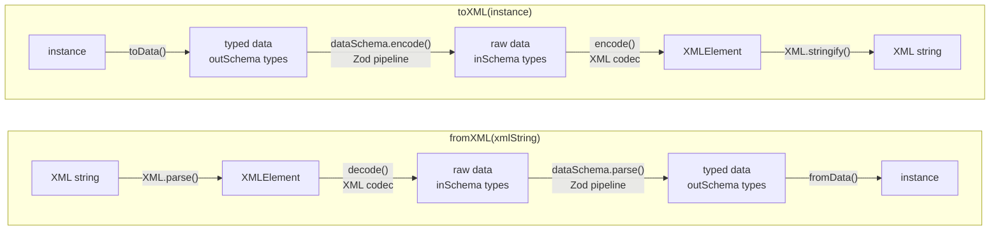

# Models

A **model** is a class produced by `xmlModel()`. It carries a Zod schema that drives both parsing and serialisation, and exposes static helpers for converting to and from XML.

## Creating a model

Pass a Zod schema and an optional `{ tagname }` for the root element. Plain Zod types become child elements automatically; use `xml.attr()` for XML attributes and `xml.prop()` when you need to customise an element:

```ts
import { z } from "zod";
import { xmlModel, xml } from "xml-model";

class Article extends xmlModel(
  z.object({
    slug: xml.attr(z.string(), { name: "slug" }),
    title: z.string(),
  }),
  { tagname: "article" },
) {}
```

When `tagname` is omitted the class name is converted to kebab-case automatically (`ArticleSection` → `<article-section>`).

## Static API

| Method / property                         | Description                                                                                                    |
| ----------------------------------------- | -------------------------------------------------------------------------------------------------------------- |
| `MyClass.fromXML(xml)`                    | Parses an XML string or `XMLRoot` and returns a `MyClass` instance.                                            |
| `MyClass.toXML(instance)`                 | Converts an instance to an `XMLRoot` document tree.                                                            |
| `MyClass.toXMLString(instance, options?)` | Converts an instance to an XML string.                                                                         |
| `MyClass.dataSchema`                      | The raw `ZodObject` schema. Use for codec internals, `z.array()`, or `.extend()`.                              |
| `MyClass.schema()`                        | Returns a `ZodPipe` that transforms parsed data into a class instance. Use inside `xml.prop()` or `z.array()`. |

## Parsing pipeline

`fromXML` and `toXML` are two-layer pipelines. The XML codec layer handles serialization between raw XML and inSchema types (strings, numbers, plain objects). The Zod layer handles type transforms between inSchema and outSchema types (e.g. `string → Date`, raw data `→` class instance).

::: code-group

```txt
fromXML(xmlString)                      toXML(instance)
──────────────────                      ───────────────
  XML string                              instance
      │ XML.parse()                           │ toData()
      ▼                                       ▼
  XMLElement                             typed data  (outSchema types)
      │ decode()        [XML codec]           │ dataSchema.encode()  [Zod]
      ▼                                       ▼
  raw data  (inSchema types)             raw data  (inSchema types)
      │ dataSchema.parse()    [Zod]           │ encode()       [XML codec]
      ▼                                       ▼
  typed data  (outSchema types)          XMLElement
      │ fromData()                            │ XML.stringify()
      ▼                                       ▼
  instance                               XML string
```

<!-- mermaid id not built-in right now so we keep diagram for later maybe -->



:::

- **XML codec** (`decode` / `encode`) — converts between `XMLElement` and inSchema types. For a `z.string()` field this is the text content; for a ZodObject it is a plain data object; for a nested model it is that model's raw data.
- **Zod pipeline** (`dataSchema.parse` / `dataSchema.encode`) — applies `z.codec` transforms (e.g. ISO string → `Date`) and constructs class instances. Unknown keys are stripped here, which is why `XMLBase` is needed for round-trip preservation.

## Class extension via `.extend()`

`.extend()` creates a **true subclass** — child instances are `instanceof` the parent and inherit all its methods.

<<< @/../src/xml/examples.ts#vehicle

<<< @/../src/xml/examples.ts#car

```ts
const car = Car.fromXML(`
  <car vin="V001">
    <make>Toyota</make><year>2020</year><doors>4</doors>
    <engine type="petrol"><horsepower>150</horsepower></engine>
  </car>
`);

car.doors; // 4         — Car field
car.label(); // "2020 Toyota" — Vehicle method, inherited
car instanceof Car; // true
car instanceof Vehicle; // true
```

### Chained extension

`.extend()` chains across multiple levels:

<<< @/../src/xml/examples.ts#sport-car

```ts
const sc = SportCar.fromXML(`...`);
sc instanceof SportCar; // true
sc instanceof Car; // true
sc instanceof Vehicle; // true
```

### Inline extend (no explicit class)

You can use `.extend()` inline without naming the intermediate class:

```ts
class Truck extends Vehicle.extend({ payload: z.number() }, xml.root({ tagname: "truck" })) {}
```

## Fresh class pattern

When you want a standalone class that reuses a schema shape **without** a prototype link to the parent, pass an extended schema to `xmlModel()` directly:

<<< @/../src/xml/examples.ts#car-no-proto

```ts
const car = CarStandalone.fromXML(`...`);
car instanceof Vehicle; // false — no shared prototype
// car.label is undefined — Vehicle methods not available
```

Use this when the class hierarchy doesn't matter and you just want to share field definitions.

## Round-trip preservation

By default, `xmlModel()` does not preserve element ordering or unknown elements across a decode → encode cycle. Use `XMLBase` or `XMLBaseWithSource` as the base class to opt in.

### `XMLBase`

Extend `XMLBase` instead of `xmlModel()` to preserve:

- **Element ordering** — elements are re-emitted in the order they appeared in the source XML, not in schema-definition order.
- **Unknown elements** — elements with no matching schema field are passed through verbatim on re-encode.

```ts
import { XMLBase, xml } from "xml-model";

class Device extends XMLBase.extend({ name: z.string() }, xml.root({ tagname: "device" })) {}

const device = Device.fromXML(`
  <device>
    <name>Router</name>
    <vendor-extension>custom data</vendor-extension>
  </device>
`);

Device.toXMLString(device);
// <device><name>Router</name><vendor-extension>custom data</vendor-extension></device>
```

This also applies to nested model instances — unknown elements inside a nested class are preserved as long as that class also extends `XMLBase`.

### `XMLBaseWithSource`

`XMLBaseWithSource` behaves identically to `XMLBase` but additionally stores the original `XMLElement` on every instance.

```ts
import { XMLBaseWithSource, XML_STATE_KEY, xml } from "xml-model";

class Device extends XMLBaseWithSource.extend(
  { name: z.string() },
  xml.root({ tagname: "device" }),
) {}

const device = Device.fromXML(`<device><name>Router</name></device>`);
device[XML_STATE_KEY]?.source; // the original XMLElement
```

> `XML_STATE_KEY` and `xmlStateSchema` are exported from `xml-model/xml/codec` for advanced use (custom base classes, direct state access), but are not part of the standard public API.

## Direct JS class inheritance

Extend a model class with a regular `class … extends` to add methods without changing the schema:

```ts
class ElectricCar extends Car {
  isElectric() {
    return this.engine.type === "electric";
  }
}

const car = ElectricCar.fromXML(`...`);
car instanceof ElectricCar; // true
car instanceof Car; // true
car.isElectric(); // true
car.label(); // "2021 Honda" — inherited from Vehicle
```

## Two-step pattern (`xml.root` + `xmlModel`)

Annotate a schema separately with `xml.root()` and then pass it to `xmlModel()`. Useful when you want to share the schema across multiple contexts:

```ts
import { xml, xmlModel } from "xml-model";
import { z } from "zod";

const VehicleSchema = xml.root(z.object({ make: z.string() }), { tagname: "vehicle" });

class SimpleVehicle extends xmlModel(VehicleSchema) {}
SimpleVehicle.dataSchema === VehicleSchema; // true
```

## `dataSchema` and `schema()`

`dataSchema` is the raw `ZodObject`. Use it to extend schemas or pass to `xmlCodec()`:

```ts
// Extend the schema without inheriting the prototype chain
const ExtendedSchema = Vehicle.dataSchema.extend({
  payload: z.number(),
});
```

`schema()` returns a `ZodPipe` that transforms parsed data into a class instance. Use it inside `z.array()` or `xml.prop()` when embedding a model as a field of another model:

```ts
cars: xml.prop(z.array(Car.schema()), { inline: true }),
```

See [Properties — Arrays](/guide/properties#arrays) for full examples.
